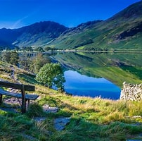
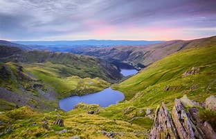
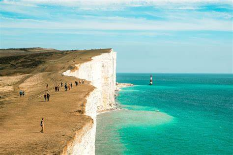
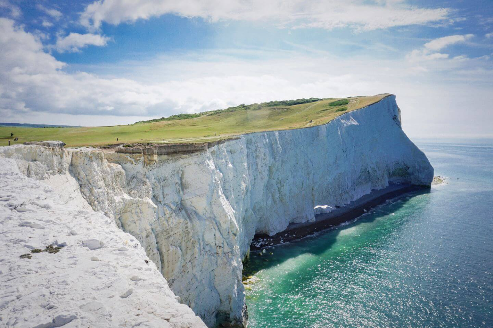
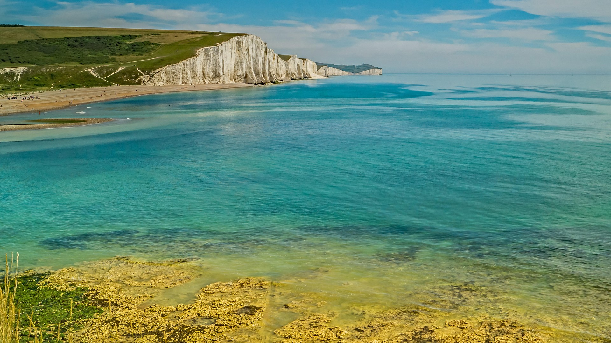
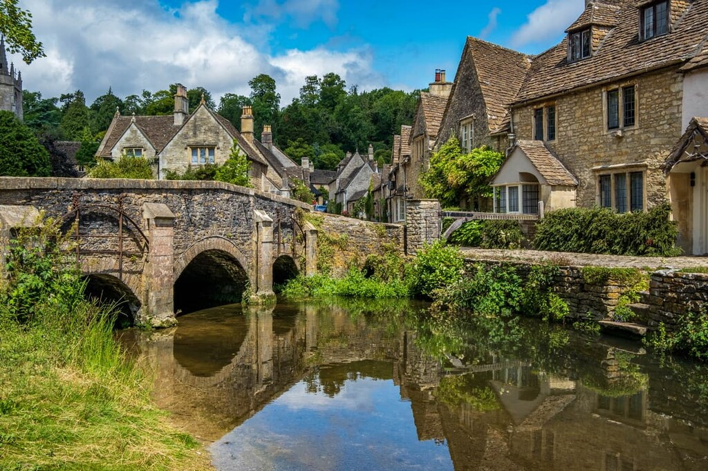
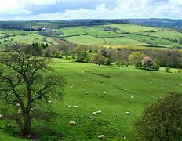
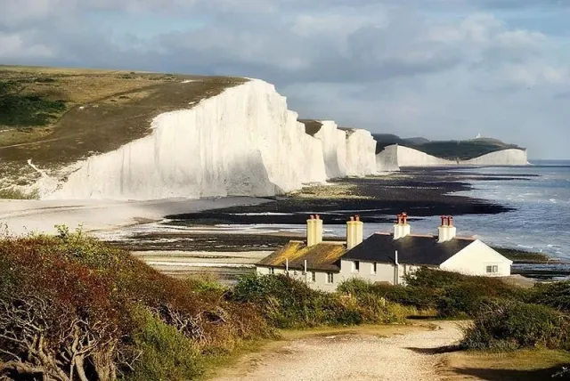
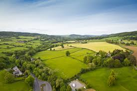

<!DOCTYPE html>
<html lang="pt-BR">
<head>
    <meta charset="UTF-8">
    <meta name="viewport" content="width=device-width, initial-scale=1.0">
    <link rel="stylesheet" href="/css/Belezas-Naturais-da-Inglaterra.css">
</head>
<body>
    <header>
        <h1>Belezas Naturais da Inglaterra</h1>
        <nav>
            <a href="index.html" class="active"> <button class="botaofooter">Início </button></a>
            <a href="atracoes.html"> <button class="botaofooter"> Atrações </button></a>
            <a href="informacoes.html"> <button class="botaofooter"> Informações </button></a>
        </nav>
    </header>
    <main>
        <section class="profile-info" >
                 
                <h2 id="ordem">Bem-vindo!</h2>
                
 Explore as incríveis belezas naturais da Inglaterra, desde suas colinas tranquilas até suas dramáticas falésias costeiras.

                
                
                
                 
                
                
                
                 
                
                
                
                 
                
                
                
                 
            </section>
            

                <button id="highlight-btn" class="BOTAO">Destacar Imagens</button>
            

    </main>
    <button id="back-to-top">↑</button>
    <footer>
        
&copy; 2024 Belezas Naturais da Inglaterra

        
 Desenvolvido por: Moises Assunção 

    </footer>
    
</body>
</html>
